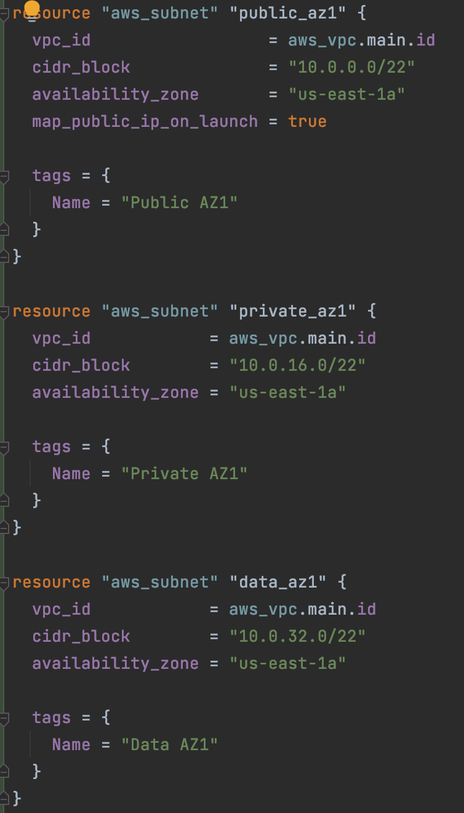
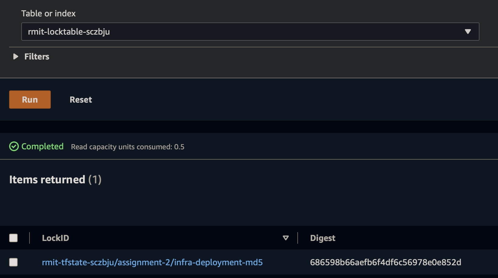

# COSC2759 Assignment 2
## Notes App - CD
- Full Name: Juventius Wu
- Student ID: s3737728

## 1. Analysis of the problem
In this section, I will be analysing the problem that Alpine Inc wants me to solve. Furthermore, I will also be discussing the possible solutions that I plan to implement in order to tackle the problem.
### 1.1 The Problem
Currently, Alpine Inc has a web application that is fully functional. Alpine Inc plans to deploy the application to AWS and let it run in the cloud using the services provided by AWS. The problem here is that the application is an ongoing product where it can have multiple releases in the future. This means that the team in Alpine Inc will have to manually deploy the application to AWS every time the application is updated into a new version. This process would certainly be tedious and waste a lot of the team's precious time.
### 1.2 The Solution
In order to eliminate this problem, I will be making full use of Terraform and Ansible. By using Terraform, I will be able to define infrastructure resources of AWS in human-readable configuration files where the team can then use them to safely and efficiently provision & manage their AWS infrastructure throughout its lifecycle. On the other hand, I will be setting up Ansible as an application-deployment tool. With the help of an Ansible playbook, the team should be able to quickly and easily deploy multiple iterations of the application to its most appropriate environment. In my solution, I will also be creating an easy step-by-step guide where the team can use to deploy the application with Terraform and Ansible. 
### 1.3 AWS Infrastructure Diagram
<br />

<br />

## 2. Terraform
Terraform is an amazing tool that we can use to set up the infrastructure for our application.The infrastructure for this application is set up in AWS.
### 2.1 Creating a VPC
The first thing that we need to do is to create a network for our application to be deployed into. A VPC provides full control over the size of our network.
<br />

<br />

<br />
I have used 10.0.0.0/16 as the CIDR block for the VPC. Afterwards, I continue to create 9 subnets for the VPC with the size of /22 with 3 layers (named public, private, and data) across 3 availability zones (az1=us-east-1a, az2=us-east-1b, az3=us-east-1c).
<br />



<br />
These subnets are useful because we can have the control of where in our private network we would like to deploy our EC2 instances and load balancer. <br />
Next, we have to create an internet gateway for the VPC so that it can connect to and from the internet.
<br />

<br />
We now have a VPC and a gateway that will allow us to connect to and from the internet. The next thing to do is to update the default route table in the VPC so AWS knows that it has to send internet bound traffic to the internet gateway.
<br />

<br />
From the screenshot above, we can see that the gateway id is set to the id of the internet gateway that we have created earlier. Also, the reason why the cidr_block is “0.0.0.0/0” is because it indicates internet bound traffic.
### 2.2 Creating a Load Balancer
The next thing to do is to create a load balancer. By using a Load Balancer, we should be able to connect to the servers as they are scaled up and down without knowing the exact ip of the server.
<br />

<br />

<br />
I have set this load balancer to be external by setting the internal value to be false. This would make the load balancer to be internet-facing, which is what we want. Furthermore, notice that I have also deployed the load balancer to all the public layers (public_az1, public_az2, public_az3). Notice that there is a security group configured in the load balancer. We will be looking into this later.
<br />
Next up, we need to create a target group for the load balancer. A target group is an essential part of a load balancer.
<br />

<br />
Since our app will be using http port 80, we need to configure the target group to set the port to 80, and the protocol to HTTP.
<br />
Lastly, we need to set up the listener for the load balancer. It is used to define the routing, and ties the port and protocol to the instances in the target group.
<br />

<br />
As you can see, I have put the arn of our load balancer to load_balancer_arn inside the listener. Furthermore, I have also put the arn of our target group to target_group_arn in default action.
<br />
### 2.3 Creating Security Groups
Now, we are going to create security groups for our load balancer, as well as for our EC2 instances that we will be creating later. For the load balancer, I have only allowed ingress for http port 80 and ssh port 22 (allowing SSH is important for Ansible to connect to our web EC2 instance). For the web EC2 instance, I have allowed our application port 3000 (this is because our node application is running in port 3000), http port 80, https port 443, and ssh port 22. For the db EC2 instance, I have allowed mongodb database port 27017 and ssh port 22. Meanwhile, for the egress of all the security groups, I have allowed all outbound traffic.
<br />
* Load Balancer security group (ingress)
  <br />
  
  
  <br />
* Web Instance security group (ingress)
  <br />
  
  
  <br />
* db Instance security group (ingress)
  <br />
  
  <br />

Now that we have our security groups, the security group configuration that we have made for the load balancer should now make sense. Next, we will be creating our EC2 instances.
### 2.4 Creating EC2 instances
In this section, we will proceed to create EC2 instances where we can deploy our application into. We will create 2 instances where one instance will be serving the front end of the application, while the other will be serving the database that will be used to support the application.
<br />


<br />

<br />
These two EC2 instances are deployed using the latest Amazon Linux 2 64-bit (x86) image. Furthermore, Both instances are located in us-east-1a where web is in the private layer, while db is in the data layer.

## 3. Ansible
Ansible is where we can automate the process to deploy our application. This tool is very handy for DevOps practitioners.
###3.1 Setting things up
In order for Ansible to deploy our application and database to the EC2 instances that we have just created, I need to grab the public IP address of both instances. This is a necessary step since Ansible will not be unable to deploy the app and db if it doesn't know where it should deploy them.
<br />

<br />
As you can see from the screenshot above, I have opted to use Terraform to generate a file 'inventory.yml' and store the public ip of web and db instance. This piece of Terraform code is written in output.tf so it will only execute near the end of the 'terraform apply' command (after the infrastructure has been set up). You can see the result below.
<br />

<br />
###3.2 Deploy Database
Now we can begin writing tasks for the deployment process in our Ansible playbook. Our database will be a mongo:4.0 database that is deployed into an ec2 instance.
<br />


<br />
From the screenshots above, I begin the process by installing docker into the db instance (for this play, 'hosts' is pointing to db instead of all or web). Since I plan to have the mongo database run as a container, docker is important to make it happen. Then, I installed the necessary packages to make sure that docker can run in the ec2 instance, and then I proceed to start the service with systemd. More about systemd later.
<br />

<br />
Next, once I have docker running, I can continue to create a mongodb container. the command to bind ip to 0.0.0.0 means that it will allow all incoming requests to the database. The volumes there just set where the log and data should be stored in the ec2 instance, Lastly, the port is 27017 since it is the default mongodb port that we need to use. Now that we have our mongo container created, it needs to be in a running state so that our app can connect to the mongo database.
<br />


<br />
As you can see, I have used a systemd config file to manage the mongo container. The contents of the config file is below.
<br />

<br />
It is nothing special. The only thing that it can do is to start the container. However, I have set this config file to be 'enabled'. This means that the file will execute every time our db instance reboots. If we just start the database from the playbook, it is not enough since the database will go back to being offline if the db instance reboots in the future.
###3.3 Deploy Application
Now that we have our database up and running, we can deploy our application to the EC2 web instance (In this case, 'hosts' shall be set to web instead of all or db).
<br />

<br />
The step above is to make sure that our yum package manager is fully updated in our web instance.
<br />

<br />
The screenshot above shoes how we can install NodeJS to an Amazon Linux 2 instance using yum. We need to setup the node repo here because yum cannot install nodejs directly like using the command 'yum install nodejs'. When nodejs is installed, we can now copy our app source code to the web instance.
<br />


<br />
As you can see from the screenshot above, after copying the source code over to the remote server, we should then install the required dependencies for the application so that it can work properly when it runs.
<br />
Now that we have installed the dependencies required for the app, we can start it so that users can access the app (website) from the internet.
<br />


<br />
As you can see, I have also start the application using systemd. Using systemd is great if we want the application to automatically start whenever its remote server reboots. I have modified the config file to set the Environment variable as SERVER instead of MONGO_URL since our app is pointing to process.env.SERVER when it is trying to connect to our db. Needless to say, I need to enable the node-app service file as well so that it can start the application automatically if system is rebooted in the future. Also, you might be wondering how I passed the value of db_url to the service file here, as well as the value of app_path. Please look at the screenshots below.
<br />


<br />
The first screenshot above is written in output.js, which means that a new yml file will be generated when ```make infra-up``` is executed. This file is placed under the ansible folder as vars/db.yml where it contains the ip address of our db instance. The second screenshot is a piece of code located in the Ansible playbook where app_path is a variable within the scope of the play named as "Deploy Application", while the vars_files has a value that points to the db.yml file generated by output.js by Terraform. Therefore, if I copy the template service.tpl from the playbook, it will replace the variable (with the curly brackets) in the service file with the appropriate values.
<br />
Lastly, we should also use the playbook to copy the artefact that we have generated with ```make pack``` from the local machine to the remote server.
<br />


<br />

## 4. Credit Work
In this part, I will be adding a few extra things to our Terraform config. Furthermore, I will also explain the limitations of using a single ec2 instance to deploy a database.
### 4.1 Using S3 backend with DynamoDB table
Since the Terraform config to create a s3 bucket and a dynamodb table has already been provided, I am not going to be going through the process of how they are created in Terraform. The only thing that I will explain here is the process of using the S3 bucket and DynamoDB table to store and lock our Terraform state file.
<br />

<br />
The code above is located in main.tf inside the "terraform { ... }" section. Also, the key value in the config there is simply going to be the name of the state file when it is stored in our S3 bucket. Now, you might be wondering why I have not placed the name of the S3 bucket and the name of the DynamoDB table inside the S3 backend config. This is because both of them are dynamic values. Since the names are dynamic, I want to automatically assign them to the S3 backend. In my opinion, it is not recommended for users to get the names and manually put them in the S3 backend config.
<br />


<br />
Since our S3 bucket and DynamoDB table is created under the bootstrap folder, I have make a script file that can be executed to send the output of our S3 bucket name and DynamoDB table name to a file named "terraform.tfvars" that is placed under the infra folder. In order to do this, users can just type ```make infra-s3``` in the terminal (current working directory must be at the root directory of the project).
<br />


<br />
As seen from above, the file "terraform.tfvars" is populated automatically with the required data. The data inside the file will then be used as parameters that ```terraform init``` can use to initate the S3 backend.
<br />

<br />
I have updated the ```make infra-init``` command to include some additional information. Therefore, when the command ```make infra-init``` is executed in the terminal, the ```terraform init``` command inside it will be taking in config data from the "terraform.tfvars" file. The reason why we have to source the dynamic values from another file (terraform.tfvars) is because dynamic values is not allowed to be put directly under the configs of S3 backend in main.tf (refer to the first screenshot under 4.1). More information here --> https://stackoverflow.com/questions/66139798/how-to-pass-variables-for-terraform-s3-backend-resource.
<br />
Now that all of that is done, in order to store the state file to our S3 bucket and lock it using our DynamoDB table, we can just run our terraform config like normal using ```make infra-up``` and it will automatically show up in our S3 bucket and DynamoDB table.
- **S3 Bucket**

  
  <br />
- **DynamoDB Table**

  
  <br />
### 4.2 The limitations in our database deployment
Our mongodb database is deployed in an EC2 instance. This means that the EC2 instance is simply a virtual machine where it acts as the medium for our mongodb database. In other words, we are using EC2 as an Infrastructure-as-a-Service (IAAS) to serve our mongodb database. In my opinion, this is certainly not the best solution for setting up a database service. This is because there are a lot of things that we need to worry about when we are dealing with IAAS. In this case, since an EC2 instance is a virtual machine running on an operating system, we are basically responsible not only on the mongodb database running on the EC2 instance, but also on the operating system as well. This implies that we also need to manage the environment where our database is running, which includes but not limited to managing software updates for the OS, tuning the OS for maximum performance, and configuring the security protocols of the OS. Besides, if we can just look at the deployment model of our database, it does not have fault tolerance either since we are only using a single EC2 instance instead of a cluster. Therefore, in the event of a vendor outage, our database will also be going down along with the EC2 instance where it was running on.
<br />
Apart from our current database deployment solution, there are two other methods that can be used to set up a MongoDB database for our application.
1. Use MongoDB Atlas. MongoDB Atlas is a fully-managed database-as-a-service (DBaaS) platform that handles all the complexity of deploying, managing, and healing your deployments on the cloud service provider of your choice (AWS , Azure, and GCP). MongoDB Atlas is the best way to deploy, run, and scale MongoDB in the cloud. More information here --> https://www.mongodb.com/docs/atlas/
2. Deploy MongoDB as a docker container to AWS Fargate using Amazon Elastic Container Service (ECS). Amazon ECS is a high-speed and highly scalable container management service. By using Amazon ECS, containers can be easily deployed, individually isolated, and are easy to distribute across multiple endpoints. Meanwhile, AWS Fargate is a serverless, pay-as-you-go compute engine that lets you focus on building applications without managing servers. AWS Fargate is fully compatible with Amazon ECS.

## 5. Distinction Work
For this part, I will be implementing the auto-assign of the latest Amazon Linux 2 AMI ID to our EC2 instances. In order to make this happen, I have to create a data source in Terraform.
<br />


<br />
As seen from above, I have assigned **most_recent** with the value of true. This will make it so that we can always get the latest ami-id. The rest of the arguments are basically the filters that are needed to get our required AMI. The **owners** field is a mandatory field where it is used to limit search of AMI owners. The value of "amazon" is assigned here since we want to fetch AMI provided by Amazon. Then, I have also specified a name as a filter so that we can always get AMI of Amazon Linux 2. I have only assigned default values to root-device-type and virtualization-type, so there is nothing special there. Lastly, the architecture filter is assigned x86_64 since it is a requirement to use 64-bit (x86) AMI for this project. Once all of that is done, we can just update the **ami** field in the aws_instance resource to obtain the AMI ID from the data source that we have just created.
<br />


<br />
By doing so, the ami id of both our EC2 instances are now dynamically assigned based on the data source, as opposed to using a hardcoded value.

## 6. High-Distinction Work
For high-distinction work, I have created a GitHub Actions pipeline to fully automate the deployment of our application. If you are currently at the root directory of this project, you can find the pipeline file at .github/workflows/ci-pipeline.yml (This file will execute in GitHub Actions whenever you push the entire source code to your GitHub repository). The pipeline will basically be used to set up our AWS infrastructure (with Terraform), and then deploy our application and database (with Ansible). In my pipeline, I have written 2 jobs.
<br />
I have made it so that the first job will only execute in the feature branch. The reason for this is because I need a way to destroy the infrastructure later with GitHub Actions as well. Therefore, I have decided to view the feature branch as a development branch that sets up infrastructure in AWS only for testing purposes.
<br />

<br />
The first job contains all the steps for setting up our AWS infrastructure and deploying the application, as well as copying state files (tfstate) to our S3 bucket where they will be used later by the second job.
<br />


<br />
The second job runs when source code is merged / pushed into the main branch.
<br />

<br />
It contains the steps to destroy the AWS infrastructure. This means that when the second job in the pipeline is triggered, it will proceed to destroy the testing infrastructure that was previously created by the first job.
<br />


<br />
As you can see, because the second job runs separately when source code is merged to the main branch, it does not have the state files that were created by the first job when source code is pushed to feature branch. Therefore, as I said earlier, I need to copy the state files over to our S3 bucket in the first job so that they can be accessed by the second job later when it wants to destroy the AWS infrastructure.
<br />

<br />
The second job will simply fetch all the deployment files (state files) from the S3 bucket and use them to perform ```terraform destroy```.
<br />
For AWS credentials, I have put them in GitHub Secrets. Therefore, all the steps in the pipeline that need to access AWS have been set with the required environment variables that point to the values stored in GitHub Secrets.
<br />

<br />

## 7. Deployment Guide
In this section, I will provide a step-by-step deployment guide using all the technologies I've mentioned above (excluding GitHub Actions). Please follow the steps below.
1. Prerequisites: Make sure to install Terraform, Ansible, Make, and AWS CLI before starting the deployment. Also, if you are using the AWS Learner Lab, you can configure your AWS credentials by opening ~/.aws/credentials and modify the file with your current AWS credentials. Otherwise, you can configure your credentials manually by executing ```aws configure``` in the terminal.
2. Clone this repository using the command: ```git clone https://github.com/rmit-computing-technologies/cosc2759-assignment-2-juventiusw.git```
3. open up the project folder that you have just cloned into your local machine using your favourite IDE.
4. If you have a terminal built into your IDE, please open it. Otherwise, open the terminal manually from your computer and cd to the root directory of the git project (cosc2759-assignment-2-juventiusw).
5. In your terminal, type ```make bootstrap``` to create an S3 bucket and DynamoDB table.
6. After that, type ```make infra-s3``` to automatically pass the name of our bucket in S3 and the name of our table in dynamodb to the terraform.tfvars file in our infra folder. our S3 backend in main.tf will be using these values.
7. Then, type ```make infra-init``` to initialize the Terraform repo.
8. Next, type ```make ssh-gen``` to create a key-pair that will be used to ssh into your ec2 instances.
9. Type ```make infra-up``` to instantiate your infrastructure in AWS using Terraform (the state file will also show up in your S3 bucket after this command is executed).
10. Next, type ```make pack``` to create an artefact that can be copied over to the remote server using Ansible.
11. Please wait for a while to let your EC2 instances boot up properly (may take a few minutes). Your EC2 instances must be in the running state for Ansible to successfully SSH to them.
12. Then, head over to the ansible folder by executing ```cd ansible``` in the terminal.
13. When you are inside the ansible folder, you can execute ```ansible-playbook -i inventory.yml -u ec2-user playbook.yml``` to deploy both the application and database to your ec2 instances. During the deployment process, If you get prompted in the terminal, just type ```yes``` and hit enter.
<br />

If you want to fully automate deployment using GitHub Actions, please follow the steps below.
1. Go to this GitHub repo in your web browser --> https://github.com/rmit-computing-technologies/cosc2759-assignment-2-juventiusw.git
2. Fork this repository to your GitHub account. Alternatively, download the entire source code from my GitHub repo, and then push all of them from your machine to a new repo in your GitHub account (this method might execute the second job in the pipeline, which will certainly fail because you haven't set up your AWS credentials in GitHub Secrets).
3. If you forked the source code to your repository, you can just clone your repository to your machine using the terminal ```git clone <link-to-your-github-repository>```.
4. Set AWS credentials in GitHub Secrets by going to your repository --> Settings --> Secrets --> Actions --> New repository secret. Then, set the values for AWS_ACCESS_KEY_ID, AWS_SECRET_ACCESS_KEY, AWS_SESSION_TOKEN, and AWS_DEFAULT_REGION. Region is needed to access AWS S3.
5. Afterwards, open the source code in your preferred IDE.
6. If you have a terminal built into your IDE, please open it. Otherwise, open the terminal manually from your computer and cd to the root directory of the project.
7. Create a new branch by executing ```git checkout -b feature/test``` in the terminal.
8. Make some changes in this README file (just type a white space or anything), which is located under the root directory of this project. Why do we need to do this? because GitHub will only allow you to push the source code in your local repo to your remote GitHub repo if you have made changes in your local repo.
9. Type and execute ```git add .``` in the terminal.
10. Then, type and execute ```git commit -m "test pipeline"```.
11. After that, type and execute ```git push -u origin feature/test```.
12. Go to your GitHub repo in the web browser and click Actions --> test pipeline --> terraform-ansible-deploy. You can see that the first job is running its steps to deploy the application to AWS with the help of Terraform and Ansible. Also, you should be able to see that the second job (terraform-destroy) in the pipeline is skipped in this workflow since it is unnecessary for now.
13. When the pipeline is finished and you have checked that the website is running just fine in AWS (go to <public-ip-address-of-your-web-instance>:3000 in your web browser), you can make a pull request from feature/test --> main, and then merge it to the main branch. This will execute the CI pipeline again, but only the second job is executed. Go to your GitHub repo in the web browser and click Actions --> Merge pull request #1 from ... --> terraform-destroy. You can see that the second job is running its steps to destroy the infrastructure that was created by the first job earlier.
